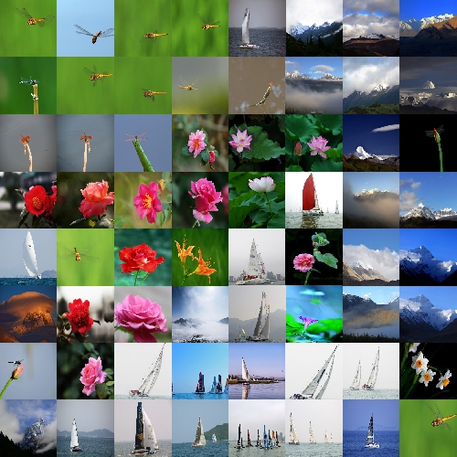
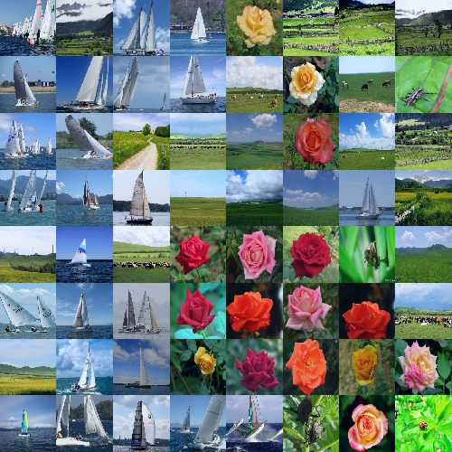

# tsne-grid
This is a python script for [tsne](https://lvdmaaten.github.io/tsne/) visualization of multiple images in a square grid.

<!--  -->
<p align="center">



</p>

### Setup
Dependencies:
* [tensorflow](https://www.tensorflow.org/install/)
* [keras](https://keras.io/)

### Usage

Basic usage:
```bash
python tsne_grid.py --dir ./examples/inputs/ --size 4
```
#### Options (required)
* `--dir`: Path to directory containing image collection.
* `--size`: Number of small images in a row/column in output image.

#### Options (optional)
* `--res`: Width/height if small images (in pixels). Default is 224.
* `--name`: Output filename. Default is tsne_grid.jpg
* `--path`: Output image path. Default is current directory.
* `--per`: Perplexity for tsne algorithm. Default is 50.
* `--iter`: Number of iterations for tsne algorithm. Default is 5000.

### Implementation details
VGG16 (without fc layers on top) is used to generate high dimensional feature representations of images. 2D representaions of these features are formed using scikit-learn's tsne implementation. These 2D representations are converted into a square grid using [Jonker-Volgenant](https://blog.sourced.tech/post/lapjv/) algorithm.